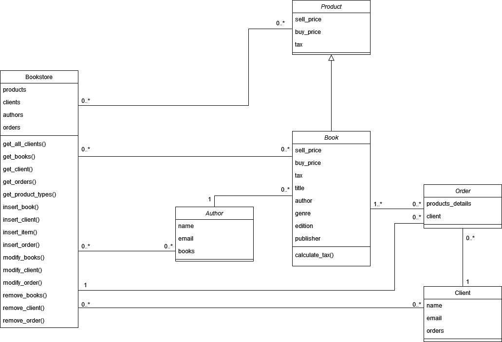
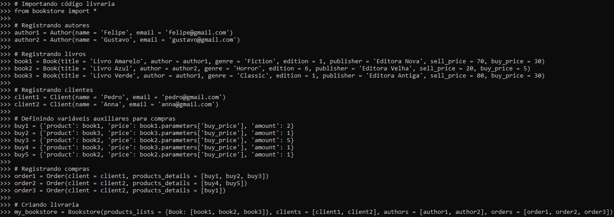
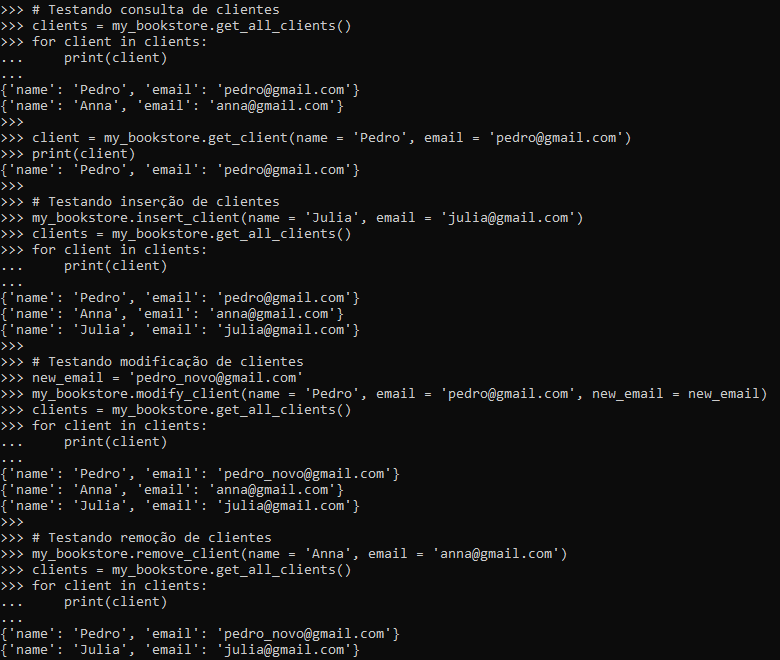
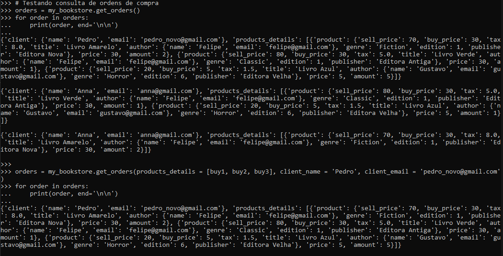
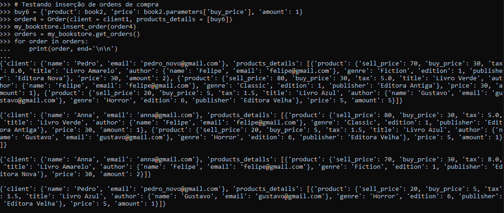
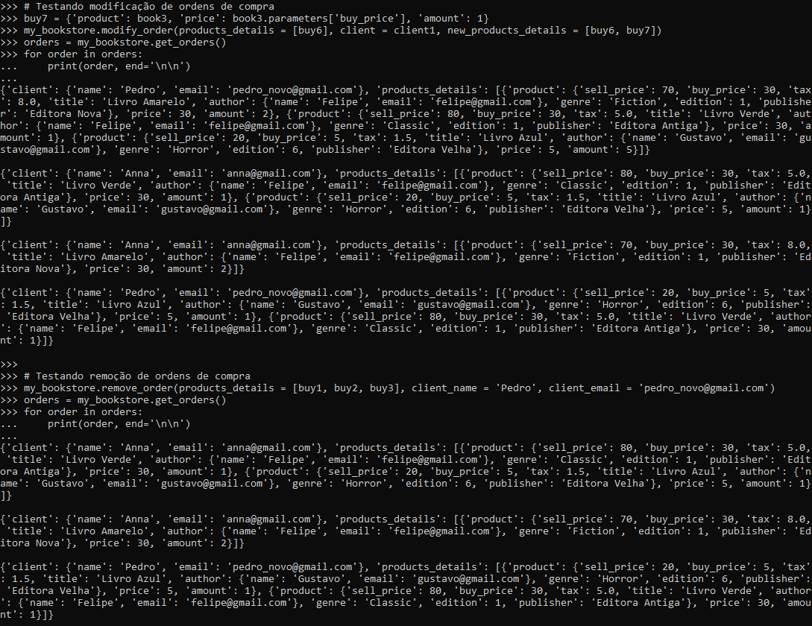

# Bookstore


## 📄 Diagrama de classes





## ☕ Como usar

Classes:

```
Product:   Classe genérica para produtos da livraria
Book:      Classe do produto específico livro (descendente da classe Product)
Author:    Classe de autor
Client:    Classe de cliente da livraria
Order:     Classe de ordem de compra
Bookstore: Classe da livraria
```

Métodos:

```
Product:
    __init__(sell_price, buy_price, tax)
        Parâmetros:
            sell_price:
                tipo: float;
                descrição: preço do venda do produto
            buy_price:
                tipo: float;
                descrição: preço do compra do produto
            tax:
                tipo: float;
                descrição: imposto do produto

Book:
    __init__(title, author, genre, edition, publisher, sell_price, buy_price)
        Parâmetros:
            title:
                tipo: string;
                descrição: título do livro
            author:
                tipo: classe Author;
                descrição: objeto Author do autor do livro
            genre:
                tipo: string;
                descrição: gênero do livro
            edition:
                tipo: int;
                descrição: edição do livro
            publisher:
                tipo: string;
                descrição: editora do livro
            sell_price:
                tipo: float;
                descrição: preço do venda do livro
            buy_price:
                tipo: float;
                descrição: preço do compra do livro
    calculate_tax(genre, sell_price, buy_price)
        Descrição: calcula o preço do imposto baseado nas características do livro
        Parâmetros:
            genre:
                tipo: string;
                descrição: gênero do livro
            sell_price:
                tipo: float;
                descrição: preço do venda do livro
            buy_price:
                tipo: float;
                descrição: preço do compra do livro
        Retorno:
            tipo: float;
            descrição: imposto calculado

Author:
    __init__(name, email, books = [])
        Parâmetros:
            name:
                tipo: string;
                descrição: nome do autor
            email:
                tipo: string;
                descrição: email do autor
            books:
                tipo: list;
                descrição: lista de livros do autor

Client:
    __init__(name, email, orders = [])
        Parâmetros:
            name:
                tipo: string;
                descrição: nome do cliente
            email:
                tipo: string;
                descrição: email do cliente
            orders:
                tipo: list;
                descrição: lista de ordens de compra do cliente

Order:
    __init__(client, products_details)
        Parâmetros:
            products_details:
                tipo: lista de dicionários no formato {'product': <instance of Product>, 'price': <float>, 'amount': <int>};
                descrição: lista de compras. Na lista há um dicionário para cada produto comprado. O dicionário contém informações de: qual produto, qual o preço pago e a quantidade comprada
            client:
                tipo: classe Cliente;
                descrição: objeto da classe Client do cliente associado à ordem

Bookstore:
    __init__(products_lists, clients, authors, orders = [])
        Parâmetros:
            products_lists:
                tipo: dict;
                descrição: dicionário contendo lista de produtos da livraria. Cada chave é a classe correspondente ao tipo de produto contido em determinada lista
            clients:
                tipo: list;
                descrição: lista de objetos da classe Client contendo os clientes da livraria
            authors:
                tipo: list;
                descrição: lista de objetos da classe Author contendo os autores cadastrados na livraria
            orders (opcional):
                tipo: list;
                descrição: lista de objetos da classe Order das ordens de compras registradas na livraria
    insert_item(item)
        Descrição: Insere um item na lista de produtos da livraria
        Parâmetros:
            item:
                tipo: classe do item;
                descrição: objeto a ser inserido
        Retorno:
            -
    insert_book(book)
        Descrição: Insere um livro na lista de livros (dentro da lista de produtos) da livraria
        Parâmetros:
            book:
                tipo: classe Book;
                descrição: objeto Book a ser inserido
        Retorno:
            -
    get_books(title = None, author = None, genre = None, edition = None, publisher = None)
        Descrição: retorna livros da livraria dadas as especificações
        Parâmetros:
            title (opcional):
                tipo: string;
                descrição: título do livro
            author (opcional):
                tipo: classe Author;
                descrição: objeto Author do autor do livro
            genre (opcional):
                tipo: string;
                descrição: gênero do livro
            edition (opcional):
                tipo: int;
                descrição: edição do livro
            publisher (opcional):
                tipo: string;
                descrição: editora do livro
        Retorno:
            tipo: list;
            descrição: lista com livros que satisfazem as especificações
    remove_books(title, author, genre, edition, publisher)
        Descrição: remove livros da livraria dadas as especificações
        Parâmetros:
            title:
                tipo: string;
                descrição: título do livro
            author:
                tipo: classe Author;
                descrição: objeto Author do autor do livro
            genre:
                tipo: string;
                descrição: gênero do livro
            edition:
                tipo: int;
                descrição: edição do livro
            publisher:
                tipo: string;
                descrição: editora do livro
        Retorno:
            -
    modify_books(title, author, genre, edition, publisher, new_parameters)
        Descrição: modifca livros da livraria dadas as especificações
        Parâmetros:
            title:
                tipo: string;
                descrição: título do livro
            author:
                tipo: classe Author;
                descrição: objeto Author do autor do livro
            genre:
                tipo: string;
                descrição: gênero do livro
            edition:
                tipo: int;
                descrição: edição do livro
            publisher:
                tipo: string;
                descrição: editora do livro
            new_parameters:
                tipo: dict;
                descrição: novos parâmetros do livro. As chaves devem respeitar os parâmetros possíveis para um livro: 'title', 'author', 'genre', 'edition', 'publisher', 'buy_price', 'sell_price', 'buy_price' e 'tax'.
        Retorno:
            -
    insert_client(name, email, orders = [])
        Descrição: Insere um cliente na lista de clientes da livraria
        Parâmetros:
            name:
                tipo: string;
                descrição: nome do cliente
            email:
                tipo: string;
                descrição: email do cliente
            orders (opcional):
                tipo: lista;
                descrição: lista de ordens de compra do cliente
        Retorno:
            -
    remove_client(name, email)
        Descrição: remove clientes da livraria dadas as especificações
        Parâmetros:
            name:
                tipo: string;
                descrição: nome do cliente
            email:
                tipo: string;
                descrição: email do cliente
        Retorno:
            -
    modify_client(name, email, new_name = None, new_email = None, new_orders = None)
        Descrição: modifica um cliente da livraria dadas as especificações
        Parâmetros:
            name:
                tipo: string;
                descrição: nome do cliente
            email:
                tipo: string;
                descrição: email do cliente
            new_name (opcional):
                tipo: string;
                descrição: novo nome do cliente
            new_email (opcional):
                tipo: string;
                descrição: novo email do cliente
            new_orders (opcional):
                tipo: list;
                descrição: nova lista de ordens do cliente
        Retorno:
            -
    get_client(name, email)
        Descrição: retorna o cliente da livraria dadas as especificações
        Parâmetros:
            name:
                tipo: string;
                descrição: nome do cliente
            email:
                tipo: string;
                descrição: email do cliente
        Retorno:
            tipo: classe Client;
            descrição: cliente que satisfaz as especificações
    get_all_clients()
        Descrição: retorna o cliente da livraria dadas as especificações
        Parâmetros:
            -
        Retorno:
            tipo: lista de objetos da classe Client;
            descrição: lista contendo todos os clientes da livraria
    insert_order(order)
        Descrição: Insere uma ordem na lista de ordens da livraria
        Parâmetros:
            order:
                tipo: classe Order;
                descrição: objeto Order a ser inserido
        Retorno:
            -
    remove_order(products_details, client_name, client_email)
        Descrição: Remove uma ordem da lista de ordens da livraria
        Parâmetros:
            products_details:
                tipo: lista de dicionários no formato {'product': <instance of Product>, 'price': <float>, 'amount': <int>};
                descrição: lista de compras. Na lista há um dicionário para cada produto comprado. O dicionário contém informações de: qual produto, qual o preço pago e a quantidade comprada
            client_name:
                tipo: string;
                descrição: nome do cliente da ordem
            client_email:
                tipo: string;
                descrição: email do cliente da ordem
        Retorno:
            -
    modify_order(products_details, client, new_products_details = None, new_client = None)
        Descrição: Modifica uma ordem da lista de ordens da livraria
        Parâmetros:
            products_details:
                tipo: lista de dicionários no formato {'product': <instance of Product>, 'price': <float>, 'amount': <int>};
                descrição: lista de compras. Na lista há um dicionário para cada produto comprado. O dicionário contém informações de: qual produto, qual o preço pago e a quantidade comprada
            client:
                tipo: classe Client;
                descrição: cliente associado à ordem
            new_products_details (opcional):
                tipo: lista de dicionários no formato {'product': <instance of Product>, 'price': <float>, 'amount': <int>};
                descrição: nova lista de compras. Na lista há um dicionário para cada produto comprado. O dicionário contém informações de: qual produto, qual o preço pago e a quantidade comprada
            new_client (opcional):
                tipo: classe Client;
                descrição: novo cliente associado à ordem
        Retorno:
            -
    get_orders(products_details = None, client_name = None, client_email = None)
        Descrição: Retorna todas as ordens da lista de ordens da livraria
        Parâmetros:
            products_details (opcional):
                tipo: lista de dicionários no formato {'product': <instance of Product>, 'price': <float>, 'amount': <int>};
                descrição: lista de compras. Na lista há um dicionário para cada produto comprado. O dicionário contém informações de: qual produto, qual o preço pago e a quantidade comprada
            client_name (opcional):
                tipo: string;
                descrição: nome do cliente da ordem
            client_email (opcional):
                tipo: string;
                descrição: email do cliente da ordem
        Retorno:
            tipo: list;
            descrição: lista de ordens da livraria
    get_product_types()
        Descrição: Retorna todas os tipos de produtos da livraria (retorna a classe de cada tipo)
        Parâmetros:
            -
        Retorno:
            tipo: list;
            descrição: lista de tipos de produtos da livraria
        
```

Atributos:

```
Product:
    parameters
        tipo: dict;
        descrição: contém os atributos do produto. São eles, inicialmente: 'sell_price', 'buy_price' e 'tax'

Book:
    parameters
        tipo: dict;
        descrição: contém os atributos do produto e do livro. São eles, do produto: 'sell_price', 'buy_price' e 'tax'. Do livro: 'title', 'author', 'genre', 'edition' e 'publisher'

Author:
    name
        tipo: string;
        descrição: nome do autor
    email
        tipo: string;
        descrição: email do autor
    books
        tipo: list;
        descrição: lista de livros do autor

Client:
    name
        tipo: string;
        descrição: nome do cliente
    email
        tipo: string;
        descrição: email do cliente
    orders
        tipo: list;
        descrição: lista de ordens de compra do cliente

Order:
    products_details
        tipo: lista de dicionários no formato {'product': <instance of Product>, 'price': <float>, 'amount': <int>};
        descrição: lista de compras. Na lista há um dicionário para cada produto comprado. O dicionário contém informações de: qual produto, qual o preço pago e a quantidade comprada
    client
        tipo: classe Cliente;
        descrição: objeto da classe Client do cliente associado à ordem

Bookstore:
    products
        tipo: dict;
        descrição: dicionário contendo lista de produtos da livraria. Cada chave é a classe correspondente ao tipo de produto contido em determinada lista
    clients
        tipo: list;
        descrição: lista de objetos da classe Client contendo os clientes da livraria
    authors
        tipo: list;
        descrição: lista de objetos da classe Author contendo os autores cadastrados na livraria
    orders
        tipo: list;
        descrição: lista de objetos da classe Order das ordens de compras registradas na livraria
```


## ✔ Testes







